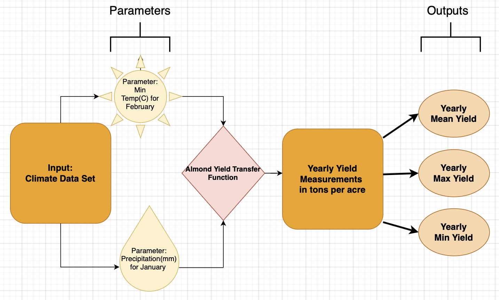

```{r setup, include=FALSE}
knitr::opts_chunk$set(echo = TRUE, warning = FALSE, message = FALSE)
library(tidyverse)

library(purrr)

library(ggpubr)

library(here)

```

## 1. Draw diagram to represent your model - how it will translate inputs to outputs, with parameters that shape

the relationship between inputs an outputs - on your diagram list what your inputs, parameters and outputs are with units

-   Inputs:

1.  Climate Dataset

-   Parameters:

1.  Precipitation in mm for January
2.  Minimum temperature in Celsius for February

-   Outputs:

1.  Mean Almond Yield
2.  Maximum Almond Yield
3.  Minimum Almond Yield

### Diagram for our Almond Yield Function

Our diagram shows inputs, parameters and outputs from out dataset.

{width="500"}

## 2. Implement your diagram as an R function

Our goal is to implement a simple model of almond yield anomaly response to climate The climate dataframe includes daily time series of minimum, maximum daily temperatures and precipitation.

We would like to output the yields for yearly almond yields.

Our model will use the Almond transfer equation stated below :

$$Almond Yield = -0.015T_{n,2} - 0.0046T^2_{n,2} - 0.07P_1 + 0.0043P^2_1 + 0.28$$ {source: Lobell et al.(2006)}

where:

$T_{n2} =$Minimum Temperature in Celcius for the Month of February 

$P_1 =$Precipiation in mm for the Month of January

```{r read in data}
# --------------------------------------
#               Read In Data
# ---------------------------------------
#read in txt file
#climate_data <- read.table(file="../Data/clim.txt", sep="")

#write the csv to have for future use
# write_csv(climate_data, here::here("Data", "clim.csv"))

climate_data <- read_csv(here("Data", "clim.csv"))
```

### Data Cleaning

The climate data is going to need to be preprocessed because the the model uses climate data from a particular month, yet we have ALL of the climate measurements for multiple times per day.

We chose to preprocess within our function to make it easier for the user to get the necessary output they are interested in and for future use in order to generalize for other crops. Therefore the function takes in our climate dataset as an csv as an input.

Below is our data cleaning process. Note that we used the mean minimum temperature found after grouping by month and year. According to the equation adapted by Lobell et al. 2006, monthly averages of minimum temperature were computed. We also summed the precipitation amount also found in the daily reading which is outputted for the whole year and month of January.

```{r, data cleaning}
# -----------------------------------------------
#                  Data Cleaning 
# -----------------------------------------------
  
# subset min_temp for feb 
min_temp <- climate_data %>% 
  group_by(month, year) %>% # grouping by month and year
  filter(month == 2) %>% # select just feb
  summarise(feb_tmin_c = mean(tmin_c)) %>% #find mean temp per year
  group_by() %>% 
  select(-month) #take our month from dataframe
  
# calculate total january precipitation for each year
precip <- climate_data %>%
  group_by(month, year) %>%
  filter(month == 1) %>% # select just jan
  summarise(jan_precip_mm = sum(precip)) %>% #find sum of precip per year
  group_by() %>% 
  select(-month)
  
# join dataset together
yield <- left_join(min_temp, precip) 

# showing joined dataset to show that min temp and precip are in one dataset
head(yield)
```

### Find Almond Yield

We input those `feb_tmin_c` and `jan_precip_mm` into our equations to give us the almond yields we are interested in. In this case, we want to output the maximum, minimum, and mean yields over all of the years.

From the joined `yield` dataset, we created a new column with the almond yield equation.

```{r almond yield}
# -----------------------------------------------
#                  Almond Yield Equation
# -----------------------------------------------
#create the equation needed to find almond yield
yield <- yield %>% 
  mutate(yield_tons = -0.015*feb_tmin_c - 0.0046*feb_tmin_c^2 - 0.07*jan_precip_mm + 0.0043*jan_precip_mm^2 + 0.28) # calc based on  equation from lobell et al. 2006

# calculate the min, max, and mean yield over the whole time period
min_yield <- min(yield$yield_tons)
max_yield <- max(yield$yield_tons)
mean_yield <- mean(yield$yield_tons)

# print the min, max, and mean
cat(paste0("Minimum Yield: ", round(min_yield, 2), "ton(s) per acre \n",
                      "Maximum Yield: ", round(max_yield, 2), "ton(s) per acre \n",
                      "Mean Yield: ", round(mean_yield, 2), "ton(s) per acre"))

```

Below is how you can call in the function created on out R script (`almond_yield.R`). Our R script takes in the climate data frame as the input to the function and extracts the useful data from it as
part of the model.

```{r, fuction_call}
# -----------------------------------------------
#                  Function Call 
# -----------------------------------------------
# sourcing in almond_yield function
source("almond_yield.R")

almond_yield(climate_data)
```
